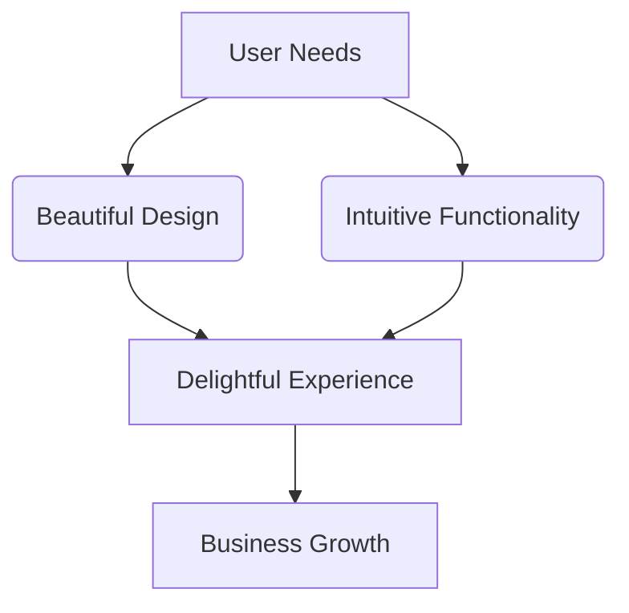

  

  <strong style="color:#9B30FF;">❤️‍🔥Front-End Developer & WordPress Customizer</strong> 
  <em style="color:#FF1493;">"Passion in pixels, calm in code."</em>

  
  
  
  
  
  

---

## 🌟 Digital Artisan: Yalda

🎨 **Pixel Perfectionist** | **UI Magician** | **WordPress Whisperer**

---
### 🛠️ My Creative Arsenal

<table align="center">
  <tr>
    <td align="center" width="150">
      
       
      <b>WordPress Wizardry</b>
       
      Theme Crafting Plugin Alchemy
    </td>
    <td align="center" width="150">
      
       
      <b>Front-End Sorcery</b>
       
      Semantic HTML5 CSS3 Magic
    </td>
    <td align="center" width="150">
      
       
      <b>JS Enchantmen</b>
       
      ES6+ Incantations
    </td>
  </tr>
  <tr>
    <td align="center" width="150">
      
       
      <b>UI/UX Alchemy</b>
       
      Pixel Perfection User Journeys
    </td>
    <td align="center" width="150">
      
       
      <b>Design Magic</b>
       
      Prototyping Design Systems
    </td>
    <td align="center" width="150">
      
       
      <b>Performance Arts</b>
       
      Speed Optimization Lighthouse 100%
    </td>
  </tr>
</table>

✨ <i>Every tool mastered, every skill honed - all to create digital magic</i> ✨

### 🎯 Design Philosophy:

💖 **Twin Synergy**  
Working in perfect harmony with my brilliant twin  
  
to create digital experiences that spark joy ✨

---

### 🏆 Recent Magic:
- 🚀 Built a WordPress site loading in <1.2s
- 🎭 Created an interactive gallery with 0 JS frameworks
- 🌈 Developed a color accessibility plugin

---

## 🛠️ Programming Skills

| Language       | Main Usage                         | Proficiency |
|----------------|----------------------------------|-------------|
| HTML5 🧱       | Markup & semantic structure       | ⭐⭐⭐⭐⭐      |
| CSS3 🎨        | Styling, animations, layout       | ⭐⭐⭐⭐☆      |
| JavaScript ✨   | DOM scripting, dynamic interactions | ⭐⭐⭐⭐☆   |
| PHP 🐘         | WordPress themes & logic          | ⭐⭐⭐☆☆      |
| Python 🐍      | Scripting & learning              | ⭐⭐☆☆☆      |
| WordPress ⚙️   | Elementor, WooCommerce, SEO      | ⭐⭐⭐⭐☆      |

---

## 🧩 Tech Stack

<table align="center">
  <tr>
    <th colspan="3" style="text-align:center; background-color:#f3e5f5; border-radius:8px 8px 0 0;">
      <h3 style="margin:8px;color:#7b1fa2;">✨ My Development Toolkit</h3>
    </th>
  </tr>
  <tr>
    <td align="center" style="border-right:1px solid #e1bee7; border-bottom:1px solid #e1bee7; padding:12px;">
      <h4>🎨 Front-End</h4>
      
      
      
      

      Responsive Design • CSS Animations • Pixel-Perfect UI
      

    </td>
    <td align="center" style="border-right:1px solid #e1bee7; border-bottom:1px solid #e1bee7; padding:12px;">
      <h4>🪄 WordPress</h4>
      
      
      
      

      Custom Themes • Plugin Development • SEO Optimization
      

    </td>
    <td align="center" style="border-bottom:1px solid #e1bee7; padding:12px;">
      <h4>🧰 Development Tools</h4>
      
      
      
      

      LocalWP • XAMPP • Trello • Performance Tools
      

    </td>
  </tr>
  <tr>
    <td colspan="3" style="text-align:center; background-color:#f3e5f5; border-radius:0 0 8px 8px; padding:8px;">
      

      <i>"Mastering the tools that bring digital visions to life"</i> ✨
      

    </td>
  </tr>
</table>

---

## 🚀 Featured Projects

  <h3 style="color:#7b1fa2; border-bottom:2px solid #e1bee7; display:inline-block; padding-bottom:5px;">✨ My Project Showcase ✨</h3>

<table align="center" width="90%">
  <tr>
    <td style="padding:20px; border-radius:10px; background:linear-gradient(135deg, #f3e5f5 0%, #e1bee7 100%); margin-bottom:20px;">
      

        
🌈

        

          <h3 style="margin:0; color:#7b1fa2; font-size:1.2em;">30 Days Front-End Challenge</h3>
          
Daily UI magic with pure front-end sorcery!

          

            HTML5
            CSS3
            JavaScript
          

        

      

      

        <a href="https://github.com/YALDAKHOSHPEY/30days-frontend" style="display:inline-block; background:#8A2BE2; color:white; padding:8px 20px; border-radius:6px; text-decoration:none; font-weight:bold; transition:all 0.3s; font-size:0.9em;" onmouseover="this.style.transform='scale(1.02)'; this.style.boxShadow='0 4px 8px rgba(138, 43, 226, 0.3)';" onmouseout="this.style.transform='scale(1)'; this.style.boxShadow='none';">
          Explore the Magic →
        </a>
      

    </td>
  </tr>
  
  <tr>
    <td style="padding:20px; border-radius:10px; background:linear-gradient(135deg, #f3e5f5 0%, #e1bee7 100%);">
      

        
🎓

        

          <h3 style="margin:0; color:#7b1fa2; font-size:1.2em;">CS50x - Harvard Journey</h3>
          
Mastering computer science fundamentals through hands-on projects

          

            C
            Python
            JavaScript
            SQL
          

        

      

      

        <a href="https://github.com/YALDAKHOSHPEY/cs50x" style="display:inline-block; background:#8A2BE2; color:white; padding:8px 20px; border-radius:6px; text-decoration:none; font-weight:bold; transition:all 0.3s; font-size:0.9em;" onmouseover="this.style.transform='scale(1.02)'; this.style.boxShadow='0 4px 8px rgba(138, 43, 226, 0.3)';" onmouseout="this.style.transform='scale(1)'; this.style.boxShadow='none';">
          Dive Into Code →
        </a>
      

    </td>
  </tr>
</table>

  
"Every project is a new adventure in problem-solving and creativity"

---

## 📈 GitHub Stats

  

    
    
  

  
  

    
  

---

## Let's Connect

  
  
  
  
  

---

## 🐍 GitHub Contribution Snake

  

## 😼 Meme Vibes

**👯‍♀️ Yalda & Vida**🎇

  
   
  <em>"Typing like a legend. Panicking like a human." 😹</em>

