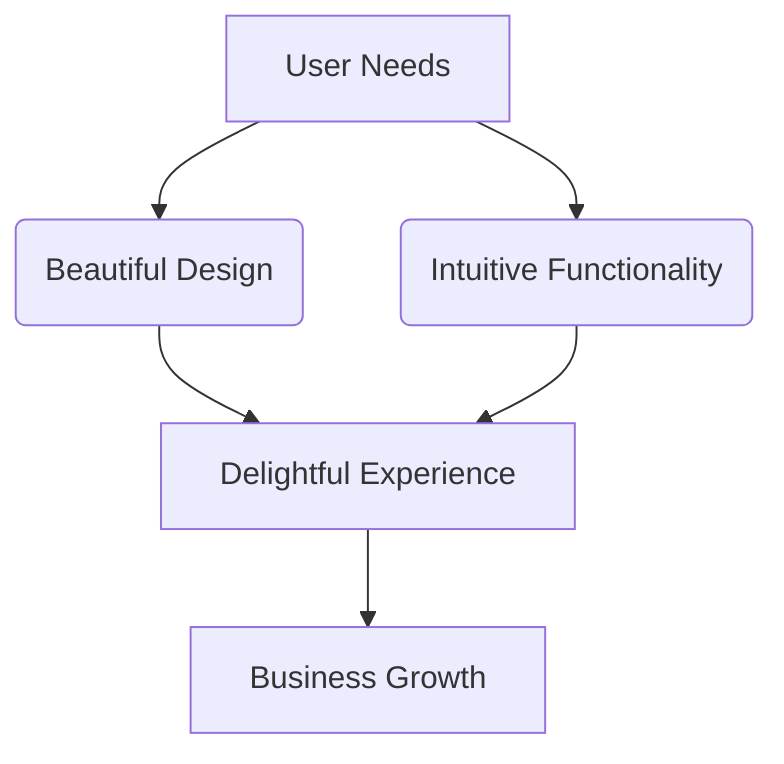

  

  <strong style="color:#9B30FF;">❤️‍🔥Front-End Developer & WordPress Customizer</strong> 
  <em style="color:#FF1493;">"Passion in pixels, calm in code."</em>

  
  
  
  
  
  

---

## 🌟 Digital Artisan: Yalda

🎨 **Pixel Perfectionist** | **UI Magician** | **WordPress Whisperer**

### 🛠️ My Creative Arsenal

<table align="center">
  <tr>
    <td align="center" width="150">
      
       
      <b>WordPress Wizardry</b>
       
      Theme Crafting Plugin Alchemy
    </td>
    <td align="center" width="150">
      
       
      <b>Front-End Sorcery</b>
       
      Semantic HTML5 CSS3 Magic
    </td>
    <td align="center" width="150">
      
       
      <b>JS Enchantmen</b>
       
      ES6+ Incantations
    </td>
  </tr>
  <tr>
    <td align="center" width="150">
      
       
      <b>UI/UX Alchemy</b>
       
      Pixel Perfection User Journeys
    </td>
    <td align="center" width="150">
      
       
      <b>Design Magic</b>
       
      Prototyping Design Systems
    </td>
    <td align="center" width="150">
      
       
      <b>Performance Arts</b>
       
      Speed Optimization Lighthouse 100%
    </td>
  </tr>
</table>

✨ <i>Every tool mastered, every skill honed - all to create digital magic</i> ✨

### 🎯 Design Philosophy:

💖 **Twin Synergy**  
Working in perfect harmony with my brilliant twin  
  
to create digital experiences that spark joy ✨

### 🏆 Recent Magic:
- 🚀 Built a WordPress site loading in <1.2s
- 🎭 Created an interactive gallery with 0 JS frameworks
- 🌈 Developed a color accessibility plugin

---

## 🛠️ Programming Skills

| Language       | Main Usage                         | Proficiency |
|----------------|----------------------------------|-------------|
| HTML5 🧱       | Markup & semantic structure       | ⭐⭐⭐⭐⭐      |
| CSS3 🎨        | Styling, animations, layout       | ⭐⭐⭐⭐☆      |
| JavaScript ✨   | DOM scripting, dynamic interactions | ⭐⭐⭐⭐☆   |
| PHP 🐘         | WordPress themes & logic          | ⭐⭐⭐☆☆      |
| Python 🐍      | Scripting & learning              | ⭐⭐☆☆☆      |
| WordPress ⚙️   | Elementor, WooCommerce, SEO      | ⭐⭐⭐⭐☆      |

---

## 🧩 Tech Stack

🎨 **Front-End**
- HTML5, CSS3, JavaScript  
- Responsive layouts, animations, pixel-perfect design

🪄 **WordPress Magic**
- Elementor, WooCommerce, SEO  
- Custom themes & plugins using PHP

🧰 **Tools & Platforms**
- GitHub, VSCode, XAMPP, LocalWP  
- Figma for design, Trello for task flow

---

## 🚀 Featured Projects

🌈 **30 Days Front-End Challenge**  
💡 Daily coding challenge focused on UI magic using **HTML**, **CSS**, and **JavaScript**  
🔗 [Check it out on GitHub »](https://github.com/YALDAKHOSHPEY/30days-frontend)

🎓 **CS50x – Harvard**  
🧠 Hands-on journey through **C**, **Python**, and full-stack fundamentals  
🔗 [Browse the Repo »](https://github.com/YALDAKHOSHPEY/cs50x)

---
## 📈 GitHub Stats

  
  

  

---

## Let's Connect

  
  
  
  
  

---

## 🐍 GitHub Contribution Snake

  

## 😼 Meme Vibes

**👯‍♀️ Yalda & Vida**🎇

  
   
  <em>"Typing like a legend. Panicking like a human." 😹</em>

